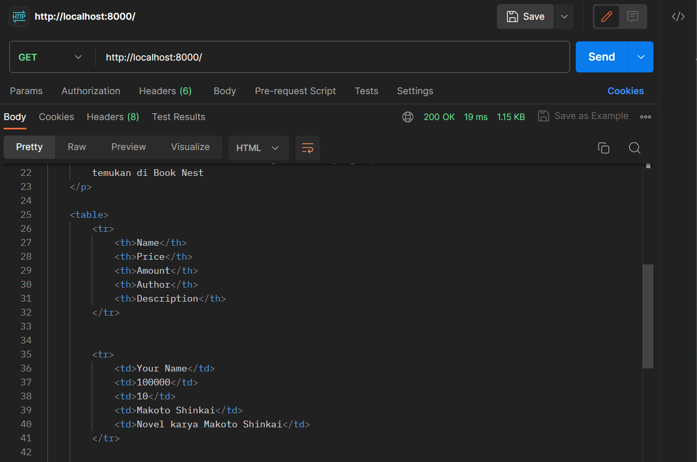
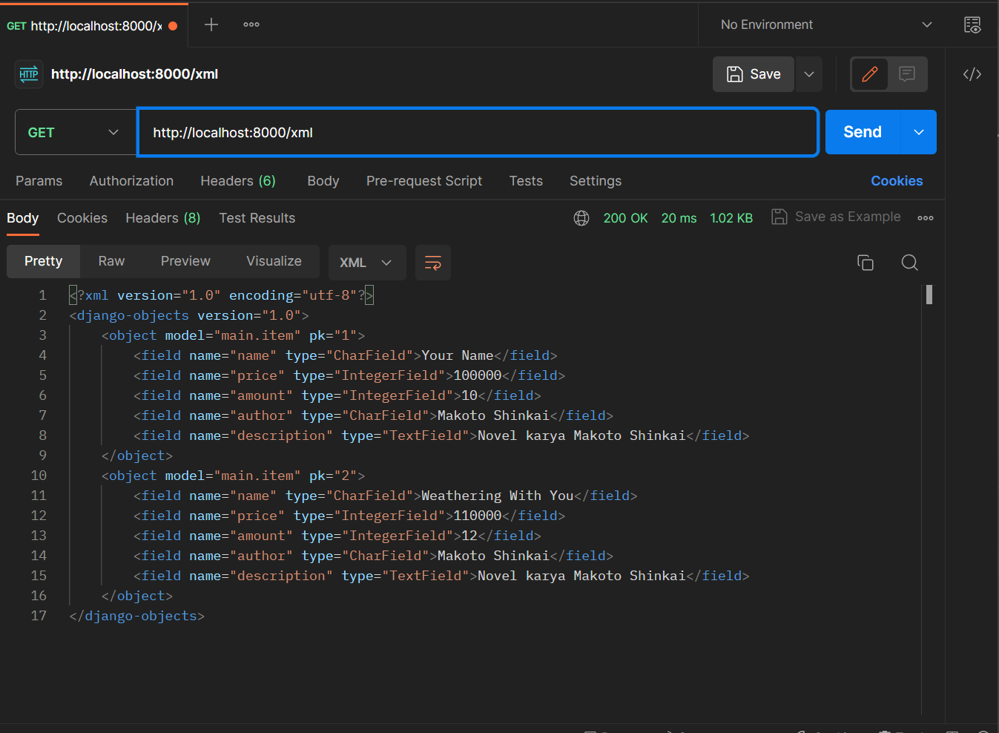
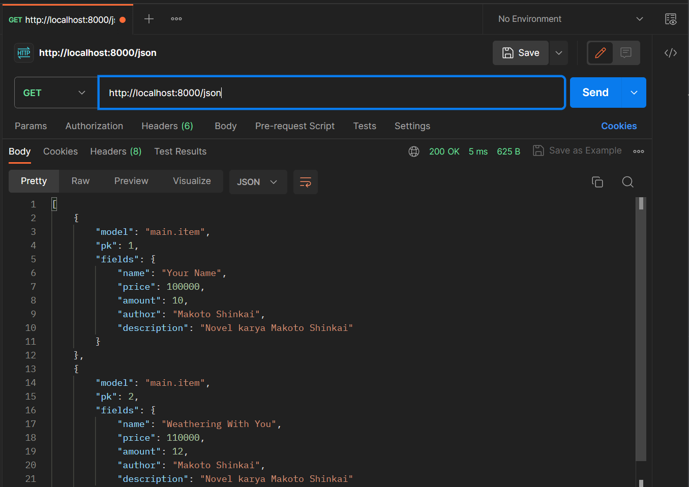
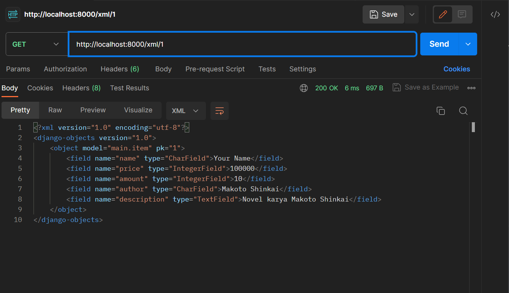

Nama : M.Alif Al Hakim

Kelas : PBP C

Tugas 3

### Apa perbedaan antara form POST dan form GET dalam Django?

form POST sendiri akan mengumpulkan data yang dimasukkan pada form, melakukan _encoding_ pada data tersebut untuk ditransmisikan dan mengirimkannya ke server. Dan setelahnya akan menerima kembali responnya.
Sementara, form GET akan mengumpulkan data yang akan dikirim menjadi sebuah string dan menggunakannya untuk membuat sebuah URL. URL tersebut mengandung alamat dimana data harus dikirim sekaligus data _keys_ dan _values_-nya.
_Request_ yang digunakan untuk mengubah kondisi dari sistem seperti mengubah database sebaiknya menggunakan POST. GET sebaiknya hanya digunakan pada _request_ yang tidak mempengaruhi kondisi sistem.
Contoh penggunaan GET seperti pada _web search form_ dan POST seperti _password form_.

### Apa perbedaan utama antara XML, JSON, dan HTML dalam konteks pengiriman data?

XML dan JSON digunakan untuk menyimpan dan men-transmisikan data, sementara HTML digunakan untuk mendeskripsikan bagaimana suatu data ditampilkan. Sementara itu XML dan JSON memiliki beberapa perbedaan yaitu:

1. XML menghasilkan suatu XML document, sementara JSON menghasilkan suatu JSON String.
2. XML menggunakan XML DOM untuk menulusuri dokumen, sementara JSON menggunakan `JSON.parse()` untuk melakukan parsing JSON string.
3. JSON cenderung lebih mudah digunakan dibanding XML dan untuk aplikasi berbasis AJAX, JSON lebih cepat dibandingkan XML

### Mengapa JSON sering digunakan dalam pertukaran data antara aplikasi web modern?

Pertama, JSON memiliki karakteristik yang simple dan mudah dibaca. JSON cenderung mudah untuk ditulis dan dipahami dikarenakan JSON menggunakan format yang _human-readable_ format yang terdiri dari pasangan _key-value_. Kedua, JSON kompatibel dan dapat digunakan pada berbagai _platform_, bahasa pemrograman, dan _frameworks_. Ketiga,JSON memiliki performa dan efisiensi yang lebih baik dibanding format pengiriman data yang lain seperti XML. Hal ini dikarenakan JSON punya struktur yang simpel dan tidak memiliki informasi yang berulang atau tidak diperlukan seperti closing tags, namespaces, dan lain-lain.

### Jelaskan bagaimana cara kamu mengimplementasikan checklist di atas secara step-by-step (bukan hanya sekadar mengikuti tutorial).

- #### Membuat input form untuk menambahkan objek model pada app sebelumnya.

1. Untuk mempermudah proses selanjutnya, diatur routing dari `main` ke `/` agar aplikasi main dapat diakses langsung saat membuka website. Buka `urls.py` yang ada pada folder proyek `book_nest` dan ubah path `main/` menjadi `''` pada `urlpatterns`.
2. Implementasi Skeleton sebagai kerangka views. Buat folder `templates` pada _root folder_ dan buat sebuah berkas HTML baru bernama `base.html` yang berfungsi sebagai template dasar halaman web lainnya. Lalu isi `base.html` dengan kode berikut:

```

<!DOCTYPE html>
<html lang="en">
    <head>
        <meta charset="UTF-8" />
        <meta
            name="viewport"
            content="width=device-width, initial-scale=1.0"
        />
        
        
    </head>

    <body>
        
        
    </body>
</html>
```

3. Pada subdirektori `book_nest`, buka `settings.py` dan sesuaikan kode berikut pada bagian `TEMPLATES`.

```
TEMPLATES = [
    {
        'BACKEND': 'django.template.backends.django.DjangoTemplates',
        'DIRS': [BASE_DIR / 'templates'], # Tambahkan kode ini
        'APP_DIRS': True,
        ...
    }
]
```

4. Ubah berkas `main.html` pada direktori `main` sehingga menggunakan template dari `base.html` seperti berikut.

```



  <h1>Book Nest</h1>

  <h5>Name:</h5>
  <p>{{name}}</p>

  <h5>Class:</h5>
  <p>{{class}}</p>

```

5. Buat berkas `forms.py` pada direktori `main` untuk membuat struktur form yang dapat menerima data item baru. Isi `forms.py` dengan kode berikut.

```
from django.forms import ModelForm
from main.models import Item

class ItemForm(ModelForm):
    class Meta:
        model = Item # Menunjukkan Model yang digunakan untuk form
        fields = ["name", "price", "amount","author","description"] # Field dari model Item
```

6. Modifikasi `views.py` pada folder `main` dengan menambahkan fungsi `create_item` yang dapat menambahkan data item setelah di-_submit_ dari form.

```
from django.http import HttpResponseRedirect
from main.forms import ItemForm
from django.urls import reverse

def create_item(request):
    form = ItemForm(request.POST or None)

    if form.is_valid() and request.method == "POST":
        form.save()
        return HttpResponseRedirect(reverse('main:show_main'))

    context = {'form': form}
    return render(request, "create_item.html", context)
```

7. Import fungsi tersebut dan tambahkan _path url_ ke dalam `urlpatterns` pada `urls.py` di `main`.

```
path('create-item', create_item, name='create_item'),
```

8.  Buat berkas `create_item.html` pada direktori `main/templates` dan isi dengan kode berikut untuk membuat halaman form

```
 
<h1>Add New Item</h1>

<form method="POST">
  
  <table>
    {{ form.as_table }}
    <tr>
      <td></td>
      <td>
        <input type="submit" value="Add Item" />
      </td>
    </tr>
  </table>
</form>



```

9. Tambahkan kode berikut pada `main.html` di dalam `` untuk menampilkan data produk dalam bentuk _table_ serta tombol "Add New Item" yang akan _redirect_ ke halaman form.

```
<p>
  Saat ini, kami memiliki total {{items.count}} judul buku yang dapat Anda
  temukan di Book Nest
</p>

<table>
  <tr>
    <th>Name</th>
    <th>Price</th>
    <th>Amount</th>
    <th>Author</th>
    <th>Description</th>
  </tr>

   Berikut cara memperlihatkan data produk di bawah baris ini
   
  <tr>
    <td>{{item.name}}</td>
    <td>{{item.price}}</td>
    <td>{{item.amount}}</td>
    <td>{{item.author}}</td>
    <td>{{item.description}}</td>
  </tr>
  
</table>

<br />

<a href="">
  <button>Add New Item</button>
</a>


```

- #### Tambahkan 5 fungsi views untuk melihat objek yang sudah ditambahkan dalam format HTML, XML, JSON, XML by ID, dan JSON by ID.

1. Modifikasi fungsi `show_main` pada `views.py` di folder `main` agar dapat mengembalikan render HTML yang berisi data-data form yang sudah di-_submit_.

```
def show_main(request):
    items = Item.objects.all() # Ambil Seluruh Item pada database

    context = {
        'name': 'M.Alif Al Hakim',
        'class': 'PBP C',
        'items': items
    }

    return render(request, "main.html", context)
```

2. Membuat fungsi `show_xml` untuk mengembalikan data-data dalam bentuk XML.

```
def show_xml(request):
    data = Item.objects.all()
    return HttpResponse(serializers.serialize("xml", data), content_type="application/xml")
```

3. Membuat fungsi `show_json` untuk mengembalikan data-data dalam bentuk JSON.

```
def show_json(request):
    data = Item.objects.all()
    return HttpResponse(serializers.serialize("json", data), content_type="application/json")
```

4. Membuat fungsi `show_xml_by_id` untuk mengembalikan data dari suatu ID dalam bentuk XML.

```
def show_xml_by_id(request, id):
    data = Item.objects.filter(pk=id)
    return HttpResponse(serializers.serialize("xml", data), content_type="application/xml")
```

5. Membuat fungsi `show_json_by_id` untuk mengembalikan data dari suatu ID dalam bentuk JSON.

```
def show_json_by_id(request, id):
    data = Item.objects.filter(pk=id)
    return HttpResponse(serializers.serialize("json", data), content_type="application/json")
```

- #### Membuat routing URL untuk masing-masing views yang telah ditambahkan pada poin 2.

Import 5 fungsi yang telah dibuat sebelumnya dan untuk setiap fungsi tambahkan _path url_ ke dalam `urlpatterns`. Isi dari `urls.py` pada folder `main` akan seperti berikut.

```
from django.urls import path
from main.views import show_main,create_item,show_xml,show_json, show_xml_by_id, show_json_by_id

app_name = 'main'

urlpatterns = [
    path('', show_main, name='show_main'),
    path('create-item', create_item, name='create_item'),
    path('xml/', show_xml, name='show_xml'),
    path('json/', show_json, name='show_json'),
    path('xml/<int:id>/', show_xml_by_id, name='show_xml_by_id'),
    path('json/<int:id>/', show_json_by_id, name='show_json_by_id'),
]
```

### Mengakses kelima URL di poin 2 menggunakan Postman, membuat screenshot dari hasil akses URL pada Postman, dan menambahkannya ke dalam README.md.






