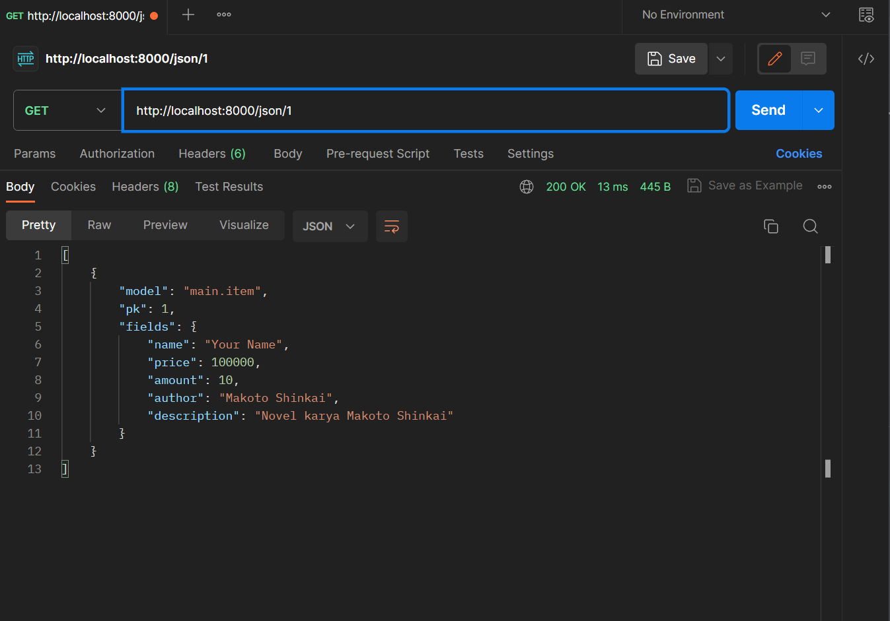

Nama : M.Alif Al Hakim

Kelas : PBP C

# Tugas 2

ink Adaptable : https://book-nest.adaptable.app/main/

### Jelaskan bagaimana cara kamu mengimplementasikan checklist di atas secara step-by-step (bukan hanya sekadar mengikuti tutorial).

##### Membuat sebuah proyek django baru

- Membuat direktori lokal dengan nama 'book_nest' lalu diinisiasi dengan git melalui perintah `git init`
- Membuat virtual environmet pada direktori yang telah dibuat dengan perintah `python -m venv env`
- Mengaktifkan virtual environmet dengan perintah `env\Scripts\activate.bat`
- Pada direktori yang sama tambahkan file `requirements.txt` dengan isi sebagai berikut.

  ```
  django
  gunicorn
  whitenoise
  psycopg2-binary
  requests
  urllib3
  ```

- Menginstall dependencies pada `requirements.txt` dengan perintah `pip install -r requirements.txt`
- Membuat Projek dengan nama `book_nest` dengan perintah `django-admin startproject book_nest .`
- Menambahkan "\*" pada ALLOWED_HOSTS di `settings.py`untuk keperluan deployment
- Tambahkan berkas `.gitignore` dan lakukan `git add` dan `git commit`pada repositori lokal
- Membuat repositori baru pada github dengan nama `book_nest` dengan visibility public
- Membuat branch utama baru pada repositori lokal dengan perintah `git branch -M main`
- Menghubungkan repositori lokal dengan github menggunakan perintah `git add origin <URL_REPO>`
- Melakukan penyimpanan pertama pada GitHub dengan `git push -u origin main`

##### Membuat aplikasi dengan nama main pada proyek tersebut.

- Buka direktori utama dari `book_nest` lalu aktifkan virtual environment
- Membuat aplikasi baru dengan perintah `python manage.py startapp main`
- Mendaftarkan aplikasi `main` ke dalam proyek. Dapat dilakukan dengan menambahkan `main` pada list `INSTALLED_APPS` di `settings.py` direktori proyek `book_nest`

##### Melakukan routing pada proyek agar dapat menjalankan aplikasi main.

- Buka berkas `urls.py` di dalam direktori proyek `book_nest` dan import fungsi `include` dari `django.urls`
- Tambahkan rute URL seperti berikut untuk mengarahkan ke tampilan `main` di dalam variabel `url_patterns`

  ```
  urlpatterns = [
      ...
      path('main/', include('main.urls')),
      ...
  ]
  ```

##### Membuat model pada aplikasi main dengan nama Item dan memiliki atribut wajib name, amount, dan description

- Buka berkas `models.py` pada direktori aplikasi main
- Isi berkas dengan kode berikut

  ```
  from django.db import models

  # Create your models here.
  class Item(models.Model):
      # Menambahkan atribut pada Item
      name = models.CharField(max_length=255) # Nama buku
      amount = models.IntegerField() # Harga
      description = models.TextField() # Deskripsi Buku
      author = models.CharField(max_length=255) # Penulis
  ```

- Menjalankan perintah `python manage.py makemigrations` untuk membuat migrasi model
- Menerapkan migrasi ke dalam basis data lokal dengan perintah `python manage.py migrate`

##### Membuat sebuah fungsi pada views.py untuk dikembalikan ke dalam sebuah template HTML yang menampilkan nama aplikasi serta nama dan kelas kamu.

- Buka berkas `views.py` pada aplikasi main lalu impor baris berikut `from django.shortcuts import render`
- Tambahkan fungsi show_main setelah mengimpor function render seperti berikut.

  ```
  def show_main(request):
      # Fungsi akan menerima permintaan HTTP dan mengembalikan tampilan yang sesuai

      # dictionary yang berisi data yang akan dikirimkan ke tampilan
      context = {
          'name': 'M.Alif Al Hakim',
          'class': 'PBP C'
      }

      # me-render tampilan main.html berdasarkan data yang dikirimkan
      return render(request, "main.html", context)
  ```

- Buat direktori baru bernama `templates` di dalam direktori aplikasi `main`
- Di dalam direktori `templates`, buat berkas baru bernama `main.html` dengan isi sebagai berikut.

  ```
  <h1>Book Nest</h1>

  <h5>Name:</h5>
  <p>{{ name }}</p> # Akan diisi oleh data yang diterima
  <h5>Class:</h5>
  <p>{{ class }} C</p>

  ```

##### Membuat sebuah routing pada urls.py aplikasi main untuk memetakan fungsi yang telah dibuat pada views.py.

- Buat berkas `urls.py` di dalam direktori `main`.
- Isi `urls.py` dengan kode berikut untuk mengatur rute URL yang terkait dengan aplikasi `main`

  ```
  from django.urls import path
  # Fungsi show_main dari modul main.views berperan sebagai tampilan yang akan ditampilkan ketika URL terkait diakses.
  from main.views import show_main

  app_name = 'main'

  urlpatterns = [
      path('', show_main, name='show_main'),
  ]
  ```

##### Melakukan deployment ke Adaptable terhadap aplikasi yang sudah dibuat sehingga nantinya dapat diakses oleh teman-temanmu melalui Internet

- Login pada Adaptable.io
- Tekan tombol `New App` dan pilih `Connect an Existing Repository`
- Pilih repositori proyek `book_nest` sebagai basis aplikasi yang akan di-deploy. Pilih branch yang ingin dijadikan sebagai deployment branch.
- Pilih Python App Template sebagai template deployment.
- Pilih PostgreSQL sebagai tipe basis data yang akan digunakan.
- Mengisi versi Python dengan 3.10 sesuai yang telah digunakan.
- Pada bagian Start Command masukkan perintah python manage.py migrate && gunicorn book_nest.wsgi.
- Masukkan nama aplikasi yang juga akan menjadi nama domain situs web aplikasi
- Centang bagian HTTP Listener on PORT dan klik Deploy App untuk memulai proses deployment aplikasi.

### Buatlah bagan yang berisi request client ke web aplikasi berbasis Django beserta responnya dan jelaskan pada bagan tersebut kaitan antara urls.py, views.py, models.py, dan berkas html.


### Jelaskan mengapa kita menggunakan virtual environment? Apakah kita tetap dapat membuat aplikasi web berbasis Django tanpa menggunakan virtual environment?

Virtual environmet adalah alat yang berguna untuk menyimpan _dependencies_ yang dibutuhkan oleh beberapa proyek berbeda dengan mengisolasi _dependencies_ yang dibutuhkan oleh setiap proyek. Contohnya ketika kita membuat dua proyek website yang menggunakan versi Django yang berbeda, maka kita dapat membuat virtual environment untuk masing-masing proyek dan menginstallnya dengan _dependencies_-nya masing-masing. Hal ini dapat mencegah terjadinya konflik pada proyek jika _dependencies_ di-_install_ di satu tempat yang sama. Selain itu, _virtual environment_ juga dapat menghindari polusi dari sistem. Polusi dapat berupa _pre-install package_ atau _package_ yang kita install sendiri. _Package_ tersebut bisa saja mempengaruhi _package_ yang kita butuhkan dalam proyek. Dengan _virtual environment_ kita bisa memastikan bahwa _package/dependencies_ yang ter-_install_ hanya yang berkaitan dengan proyek.

Jika kita tidak menggunakan _virtual environment_, maka antara proyek-proyek yang telah dibuat dapat mengalami konflik dikarenakan perbedaan _dependencies_. Hal ini dikarenakan kita hanya dapat menggunakan salah satu versi dari _library/dependencies_ terkait. Selain itu, tidak menggunakan _virtual environment_ memiliki potensi untuk terkena polusi dari sistem.

### Jelaskan apakah itu MVC, MVT, MVVM dan perbedaan dari ketiganya.

Model-View-Controller (MVC) framework adalah sebuah arsitektur/pola design yang membagi sebuah aplikasi menjadi tiga komponen utama, yaitu Model, View, Controller. Setiap komponen dibuat untuk mengerjakan tugas spesifik pada aplikasi. Controller adalah komponen yang menghubungkan view dan model. Komponen ini tidak perlu mengatasi/mengurus tentang _data logic_, komponen ini hanya perlu untuk memberi tahu model apa yang harus dilakukan dan berinteraksi dengan View untuk mendapatkan output yang dibutuhkan. View adalah komponen yang digunakan untuk mengerjakan tampilan muka dari aplikasi. Komponen ini menghasilkan tampilan muka untuk user berdasarkan permintaan yang didapat. View menghasilkan tampilan muka menggunakan data yang didapat dari model, akan tetapi view mendapatkannya melalui interaksi dengan controller. Model bertugas untuk mengurus semua yang berkaitan dengan _data logic_. Model bisa menambah atau mengambil data dari database dan memberikan respon pada controller terkait _request_ yang diterima.

Model-View-Template (MVT) framework adalah sebuah arsitektur/pola design yang membagi sebuah aplikasi menjadi
tiga komponen utama, yaitu Model, View, dan Template. View adalah komponen yang menerima _request_, memprosesnya, dan mengirimkan _response_. View mendapatkan data yang dibutuhkan melalui Models dan me-_render_-nya pada tampilan muka menggunakan Templates. Model adalah komponen yang mengatur struktur data pada aplikasi Django. Model bertanggung jawab dalam menjaga dan mengatur data yang dibutuhkan aplikasi sehingga mempunyai kemampuan dalam menambah, meng-_update_, membaca, dan menghapus data dari _database_. Template adalah sebuah _text file_ yang mendefinisikan struktur atau layout dari tampilan antar muka aplikasi. Template dapat menerima data dari view dan me-_render_-nya ke tampilan antar muka.

Model - View - ViewModel (MVVM) framework adalah sebuah arsitektur/pola design yang memisahkan antara _data presentation logic_ dan _business logic_ dari aplikasi. MVVM terdiri dari tiga komponen, yaitu Model, View, dan ViewModel. Model bertanggung jawab atas abstraksi sumber data. Model dan ViewModel akan bekerja sama dalam mendapatkan dan menyimpan data.
View adalah komponen yang bertujuan untuk memberikan informasi pada ViewModel terkait permintaan dari _user_. Komponen ini terhubung ke ViewModel dan tidak memiliki _application logic_ sama sekali. Sementara ViewModel betugas sebagai penghubung antara Model dan View.

Perbedaan dari ketiga arsitektur tersebut terletak bagaimana mereka mengorganisasi logika aplikasi, dan menampilkan tampilan antar muka. Pada MVT, View adalah komponen yang akan menerima _request_ lalu memprosesnya menjadi _respons_ dengan mengakses data dari Model dan menggunakan struktur pada Template. Sementara, pada MVC, Controller adalah komponen yang menerima input dari _user_ dan memberikan _respons_ setelah mendapatkan data yang diperlukan dari Model dan tampilan antar muka dari View. Dan terakhir, pada MVTT, View adalah komponen yang menerima permintaan dan memberikan respon pada _user_. Dimana ViewModel yang menghubungkan View dan Model dalam pertukaran data.

# Tugas 3

### Apa perbedaan antara form POST dan form GET dalam Django?

form POST sendiri akan mengumpulkan data yang dimasukkan pada form, melakukan _encoding_ pada data tersebut untuk ditransmisikan dan mengirimkannya ke server. Dan setelahnya akan menerima kembali responnya.
Sementara, form GET akan mengumpulkan data yang akan dikirim menjadi sebuah string dan menggunakannya untuk membuat sebuah URL. URL tersebut mengandung alamat dimana data harus dikirim sekaligus data _keys_ dan _values_-nya.
_Request_ yang digunakan untuk mengubah kondisi dari sistem seperti mengubah database sebaiknya menggunakan POST. GET sebaiknya hanya digunakan pada _request_ yang tidak mempengaruhi kondisi sistem.
Contoh penggunaan GET seperti pada _web search form_ dan POST seperti _password form_.

### Apa perbedaan utama antara XML, JSON, dan HTML dalam konteks pengiriman data?

XML dan JSON digunakan untuk menyimpan dan men-transmisikan data, sementara HTML digunakan untuk mendeskripsikan bagaimana suatu data ditampilkan. Sementara itu XML dan JSON memiliki beberapa perbedaan yaitu:

1. XML menghasilkan suatu XML document, sementara JSON menghasilkan suatu JSON String.
2. XML menggunakan XML DOM untuk menulusuri dokumen, sementara JSON menggunakan `JSON.parse()` untuk melakukan parsing JSON string.
3. JSON cenderung lebih mudah digunakan dibanding XML dan untuk aplikasi berbasis AJAX, JSON lebih cepat dibandingkan XML

### Mengapa JSON sering digunakan dalam pertukaran data antara aplikasi web modern?

Pertama, JSON memiliki karakteristik yang simple dan mudah dibaca. JSON cenderung mudah untuk ditulis dan dipahami dikarenakan JSON menggunakan format yang _human-readable_ format yang terdiri dari pasangan _key-value_. Kedua, JSON kompatibel dan dapat digunakan pada berbagai _platform_, bahasa pemrograman, dan _frameworks_. Ketiga,JSON memiliki performa dan efisiensi yang lebih baik dibanding format pengiriman data yang lain seperti XML. Hal ini dikarenakan JSON punya struktur yang simpel dan tidak memiliki informasi yang berulang atau tidak diperlukan seperti closing tags, namespaces, dan lain-lain.

### Jelaskan bagaimana cara kamu mengimplementasikan checklist di atas secara step-by-step (bukan hanya sekadar mengikuti tutorial).

- #### Membuat input form untuk menambahkan objek model pada app sebelumnya.

1. Untuk mempermudah proses selanjutnya, diatur routing dari `main` ke `/` agar aplikasi main dapat diakses langsung saat membuka website. Buka `urls.py` yang ada pada folder proyek `book_nest` dan ubah path `main/` menjadi `''` pada `urlpatterns`.
2. Implementasi Skeleton sebagai kerangka views. Buat folder `templates` pada _root folder_ dan buat sebuah berkas HTML baru bernama `base.html` yang berfungsi sebagai template dasar halaman web lainnya. Lalu isi `base.html` dengan kode berikut:

```

<!DOCTYPE html>
<html lang="en">
    <head>
        <meta charset="UTF-8" />
        <meta
            name="viewport"
            content="width=device-width, initial-scale=1.0"
        />
        
        
    </head>

    <body>
        
        
    </body>
</html>
```

3. Pada subdirektori `book_nest`, buka `settings.py` dan sesuaikan kode berikut pada bagian `TEMPLATES`.

```
TEMPLATES = [
    {
        'BACKEND': 'django.template.backends.django.DjangoTemplates',
        'DIRS': [BASE_DIR / 'templates'], # Tambahkan kode ini
        'APP_DIRS': True,
        ...
    }
]
```

4. Ubah berkas `main.html` pada direktori `main` sehingga menggunakan template dari `base.html` seperti berikut.

```



  <h1>Book Nest</h1>

  <h5>Name:</h5>
  <p>{{name}}</p>

  <h5>Class:</h5>
  <p>{{class}}</p>

```

5. Buat berkas `forms.py` pada direktori `main` untuk membuat struktur form yang dapat menerima data item baru. Isi `forms.py` dengan kode berikut.

```
from django.forms import ModelForm
from main.models import Item

class ItemForm(ModelForm):
    class Meta:
        model = Item # Menunjukkan Model yang digunakan untuk form
        fields = ["name", "price", "amount","author","description"] # Field dari model Item
```

6. Modifikasi `views.py` pada folder `main` dengan menambahkan fungsi `create_item` yang dapat menambahkan data item setelah di-_submit_ dari form.

```
from django.http import HttpResponseRedirect
from main.forms import ItemForm
from django.urls import reverse

def create_item(request):
    form = ItemForm(request.POST or None)

    if form.is_valid() and request.method == "POST":
        form.save()
        return HttpResponseRedirect(reverse('main:show_main'))

    context = {'form': form}
    return render(request, "create_item.html", context)
```

7. Import fungsi tersebut dan tambahkan _path url_ ke dalam `urlpatterns` pada `urls.py` di `main`.

```
path('create-item', create_item, name='create_item'),
```

8.  Buat berkas `create_item.html` pada direktori `main/templates` dan isi dengan kode berikut untuk membuat halaman form

```
 
<h1>Add New Item</h1>

<form method="POST">
  
  <table>
    {{ form.as_table }}
    <tr>
      <td></td>
      <td>
        <input type="submit" value="Add Item" />
      </td>
    </tr>
  </table>
</form>



```

9. Tambahkan kode berikut pada `main.html` di dalam `` untuk menampilkan data produk dalam bentuk _table_ serta tombol "Add New Item" yang akan _redirect_ ke halaman form.

```
<p>
  Saat ini, kami memiliki total {{items.count}} judul buku yang dapat Anda
  temukan di Book Nest
</p>

<table>
  <tr>
    <th>Name</th>
    <th>Price</th>
    <th>Amount</th>
    <th>Author</th>
    <th>Description</th>
  </tr>

   Berikut cara memperlihatkan data produk di bawah baris ini
   
  <tr>
    <td>{{item.name}}</td>
    <td>{{item.price}}</td>
    <td>{{item.amount}}</td>
    <td>{{item.author}}</td>
    <td>{{item.description}}</td>
  </tr>
  
</table>

<br />

<a href="">
  <button>Add New Item</button>
</a>


```

- #### Tambahkan 5 fungsi views untuk melihat objek yang sudah ditambahkan dalam format HTML, XML, JSON, XML by ID, dan JSON by ID.

1. Modifikasi fungsi `show_main` pada `views.py` di folder `main` agar dapat mengembalikan render HTML yang berisi data-data form yang sudah di-_submit_.

```
def show_main(request):
    items = Item.objects.all() # Ambil Seluruh Item pada database

    context = {
        'name': 'M.Alif Al Hakim',
        'class': 'PBP C',
        'items': items
    }

    return render(request, "main.html", context)
```

2. Membuat fungsi `show_xml` untuk mengembalikan data-data dalam bentuk XML.

```
def show_xml(request):
    data = Item.objects.all()
    return HttpResponse(serializers.serialize("xml", data), content_type="application/xml")
```

3. Membuat fungsi `show_json` untuk mengembalikan data-data dalam bentuk JSON.

```
def show_json(request):
    data = Item.objects.all()
    return HttpResponse(serializers.serialize("json", data), content_type="application/json")
```

4. Membuat fungsi `show_xml_by_id` untuk mengembalikan data dari suatu ID dalam bentuk XML.

```
def show_xml_by_id(request, id):
    data = Item.objects.filter(pk=id)
    return HttpResponse(serializers.serialize("xml", data), content_type="application/xml")
```

5. Membuat fungsi `show_json_by_id` untuk mengembalikan data dari suatu ID dalam bentuk JSON.

```
def show_json_by_id(request, id):
    data = Item.objects.filter(pk=id)
    return HttpResponse(serializers.serialize("json", data), content_type="application/json")
```

- #### Membuat routing URL untuk masing-masing views yang telah ditambahkan pada poin 2.

Import 5 fungsi yang telah dibuat sebelumnya dan untuk setiap fungsi tambahkan _path url_ ke dalam `urlpatterns`. Isi dari `urls.py` pada folder `main` akan seperti berikut.

```
from django.urls import path
from main.views import show_main,create_item,show_xml,show_json, show_xml_by_id, show_json_by_id

app_name = 'main'

urlpatterns = [
    path('', show_main, name='show_main'),
    path('create-item', create_item, name='create_item'),
    path('xml/', show_xml, name='show_xml'),
    path('json/', show_json, name='show_json'),
    path('xml/<int:id>/', show_xml_by_id, name='show_xml_by_id'),
    path('json/<int:id>/', show_json_by_id, name='show_json_by_id'),
]
```

### Mengakses kelima URL di poin 2 menggunakan Postman, membuat screenshot dari hasil akses URL pada Postman, dan menambahkannya ke dalam README.md.




# Tugas 4

### Apa itu Django UserCreationForm, dan jelaskan apa kelebihan dan kekurangannya?

Django `UserCreationForm` adalah kelas yang berisi formulir bawaan (_built-in_) yang sediakan oleh Django untuk membuat pengguna baru yang dapat menggunakan aplikasi web yang kita buat. Formulir ini memiliki tiga _fields_ yaitu **username**, **password1**, dan **password2** yang merupakan konfirmasi dari _password_ 1.

Kelebihan Django `UserCreationForm`:

1. Mudah digunakan dimana kita hanya perlu mengimpor modul dan menginisialisasi objek form.
2. Bisa melakukan validasi otomatis pada form, misalnya memastikan **password 1** sama dengan **password 2**.
3. Lebih mudah di-_integrasikan_ dengan sistem otentikasi dari Django

Kekurangan Django `UserCreationForm`:

1. Secara default hanya menyediakan _fields_ untuk nama/_username_ dan _password_ saja.

2. Desain/Tampilan yang terbatas.

### Apa perbedaan antara autentikasi dan otorisasi dalam konteks Django, dan mengapa keduanya penting?

Autentikasi adalah proses mem-verifikasi identitas dari seorang _user_ untuk memberikan akses ke sistem. Sementara otorisasi adalah proses memeriksa apakah suatu _user_ dapat mengakses suatu aplikasi atau _resources_ tertentu. Keduanya merupakan hal yang sangat penting karena dapat membantu menjaga keamanan aplikasi/web. Autentikasi dapat membantu mencegah akses yang tidak sah dari orang lain. Sementara, Otorisasi membantu mencegah penyalahgunaan dari seorang _user_.

### Apa itu cookies dalam konteks aplikasi web, dan bagaimana Django menggunakan cookies untuk mengelola data sesi pengguna?

Cookies adalah file teks kecil yang dikirimkan ke _browser_ dari website yang kita kunjungi. Cookies akan membantu website mengingat informasi tentang kunjungan kita, yang mana dapat membantu memudahkan kita dalam mengunjungi lagi website tersebut. Contohnya kita tidak perlu untuk login kembali ketika berpindah halaman pada suatu website.

Django sendiri akan mengirimkan cookies yang berisi Session ID ke _client-side_ dan menyimpan semua data yang berkaitan pada _server-side_.Session ID ini nanti akan dipetakan ke suatu struktur data pada _server-side_ untuk mencari informasi state terkait pada server/_database_.

### Apakah penggunaan cookies aman secara default dalam pengembangan web, atau apakah ada risiko potensial yang harus diwaspadai?

Penggunaan cookies secara default tidaklah aman. Hal ini dikarenakan terdapat potensi informasi pada cookies dapat disalahgunakan oleh klien atau koneksi yang mencurigakan. Oleh karena itu, diperlukan sistem dengan keamanan yang baik untuk mencegah hal tersebut. Salah satunya dengan menyimpan Session ID dibanding menyimpan informasi pengguna pada cookie.

### Jelaskan bagaimana cara kamu mengimplementasikan checklist di atas secara step-by-step

#### Mengimplementasikan fungsi registrasi, login, dan logout untuk memungkinkan pengguna untuk mengakses aplikasi sebelumnya dengan lancar.

- ##### Membuat Fungsi Registrasi

1. Buat fungsi register dengan parameter request, seperti berikut.

```
from django.shortcuts import redirect
from django.contrib.auth.forms import UserCreationForm
from django.contrib import messages

def register(request):
    form = UserCreationForm()

    if request.method == "POST":
        form = UserCreationForm(request.POST)
        if form.is_valid():
            form.save()
            messages.success(request, 'Your account has been successfully created!')
            return redirect('main:login')
    context = {'form':form}
    return render(request, 'register.html', context)
```

UserCreationForm adalah formulir bawaan django yang dapat memudahkan pembuatan formulir pendaftaran _user_. Form yang telah diinput akan divalidasi terlebih dahulu lalu disimpan.Setelah itu, aplikasi akan di-_redirect_ ke halaman login.

2. Buat berkas HTML dengan nama `register.html` pada folder `main/templates`. Isi dari `register.html` adalah sebagai berikut.

```



    <title>Register</title>




<div class = "login">

    <h1>Register</h1>

        <form method="POST" >
            
            <table>
                {{ form.as_table }}
                <tr>
                    <td></td>
                    <td><input type="submit" name="submit" value="Daftar"/></td>
                </tr>
            </table>
        </form>

    
        <ul>
            
                <li>{{ message }}</li>
                
        </ul>
    

</div>


```

3. Tambahkan path url dari fungsi register pada `urls.py` folder `main`.

```
path('register/', register, name='register')
```

- ##### Membuat Fungsi Login

1. Buat fungsi `login_user` pada `views.py` dengan isi sebagai berikut.

```
from django.contrib.auth import authenticate, login

def login_user(request):
    if request.method == 'POST':
        username = request.POST.get('username')
        password = request.POST.get('password')
        user = authenticate(request, username=username, password=password)
        if user is not None:
            login(request, user)
            return redirect('main:show_main')
        else:
            messages.info(request, 'Sorry, incorrect username or password. Please try again.')
    context = {}
    return render(request, 'login.html', context)
```

`authenticate` digunakan untuk melakukan autentikasi pengguna berdasarkan username dan password yang diterima dari permintaan(_request_) yang dikirim oleh pengguna saat login. Sementara `login` digunakan untuk masuk ke akun user yang sesuai setelah diautentikasi.

2. Buat halaman login dengan membuat berkas `login.html` pada folder `main/templates` seperti berikut.

```



    <title>Login</title>




<div class = "login">

    <h1>Login</h1>

    <form method="POST" action="">
        
        <table>
            <tr>
                <td>Username: </td>
                <td><input type="text" name="username" placeholder="Username" class="form-control"></td>
            </tr>

            <tr>
                <td>Password: </td>
                <td><input type="password" name="password" placeholder="Password" class="form-control"></td>
            </tr>

            <tr>
                <td></td>
                <td><input class="btn login_btn" type="submit" value="Login"></td>
            </tr>
        </table>
    </form>

    
        <ul>
            
                <li>{{ message }}</li>
            
        </ul>
    

    Don't have an account yet? <a href="">Register Now</a>

</div>


```

3. Tambahkan path url fungsi `login` ke dalam `urlpatterns` pada `urls.py`

```
path('login/', login_user, name='login'),
```

- ##### Membuat Fungsi Logout

1.  Buat fungsi `logout` pada `views.py` dengan isi sebagai berikut.

```
from django.contrib.auth import logout

def logout_user(request):
    logout(request)
    return redirect('main:login')
```

Fungsi tersebut akan menghapus sesi pengguna yang saat ini masuk dan mengarahkan pengguna kembali ke halaman login.

2. Tambahkan tombol `logout` pada berkas `main.html` seperti berikut.

```
<a href="">
    <button>
        Logout
    </button>
</a>
```

3. Tambahkan path url fungsi `logout` ke dalam `urlpatterns` pada `urls.py`

```
path('logout/', logout_user, name='logout'),
```

### Membuat dua akun pengguna dengan masing-masing tiga dummy data menggunakan model yang telah dibuat pada aplikasi sebelumnya untuk setiap akun di lokal.

1. Pada halaman login klik `Register Now` untuk membuat akun.
2. Masukkan username dan password yang memenuhi syarat dan klik `Daftar`
3. Buat akun sekali lagi dengan cara yang sama seperti sebelumnya
4. Login menggunakan akun pertama yang telah dibuat tadi sehingga _user_ akan diarahkan ke halaman main.
5. Pada halaman main klik `Add New Item` lalu isi form sesuai dengan data item yang ingin ditambahkan.
6. Lakukan langkah 5 sebanyak tiga kali sehingga tercipta 3 buah baris data.
7. Pada halaman main, klik tombol `logout` untuk keluar dari akun yang sedang digunakan.
8. Login menggunakan akun kedua dan lakukan langkah 5 hingga 7 kembali.
9. Tercipta dua akun dengan masing-masing akun punya tiga data _dummy_

### Menghubungkan model Item dengan User

1. Pada `models.py` import model `from django.contrib.auth.models import User` lalu tambah _field_ user dari model Item seperti berikut.

```
class Item(models.Model):
    user = models.ForeignKey(User, on_delete=models.CASCADE) # FIELD YANG DITAMBAHKAN
    name = models.CharField(max_length=255)
    price = models.IntegerField(null=True)
    amount = models.IntegerField()
    author = models.CharField(max_length=255)
    description = models.TextField()
```

2. Ubah fungsi `create_item` pada `views.py` direktori `main` menjadi seperti berikut.

```
def create_item(request):
    form = ItemForm(request.POST or None)

    if form.is_valid() and request.method == "POST":
        item = form.save(commit=False)
        item.user = request.user
        item.save()
        return HttpResponseRedirect(reverse('main:show_main'))

    context = {'form': form}
    return render(request, "create_item.html", context)
```

Hal ini berguna agar kita dapat mengisi field user sebelum disimpan ke database. Pada kasus ini, field user diisi dengan objek User dari return value request.user yang sedang terotorisasi untuk menandakan bahwa objek tersebut dimiliki oleh pengguna yang sedang login

3. Ubah fungsi `show_main` menjadi sebagai berikut.

```
def show_main(request):
    items = Item.objects.filter(user=request.user)

    context = {
        'name': request.user.username,
        'class': 'PBP C',
        'items': items,
        'last_login': request.COOKIES['last_login'],
    }

    return render(request, "main.html", context)
```

Perubahan berfungsi agar item yang ditampilkan hanya item dari user terkait.

4. Simpan semua perubahan dan lakukan migrasi model dengan `python manage.py makemigrations`
5. Isi default value untuk field user dengan 1 dan aplikasikan migrasi yang dilakukan sebelumnya dengan `python manage.py migrate`

### Menampilkan detail informasi pengguna yang sedang logged in seperti username dan menerapkan cookies seperti last login pada halaman utama aplikasi.

1. Pada fungsi `login_user` pada `views.py` direktori `main`, tambahkan cookie yang bernama `last_login` untuk melihat kapan terakhir kali pengguna melakukan login. Ganti kode pada blok `if user is not None` menjadi seperti berikut.

```
if user is not None:
    login(request, user)
    response = HttpResponseRedirect(reverse("main:show_main"))
    response.set_cookie('last_login', str(datetime.datetime.now()))
    return response
```

2. Pada fungsi `show_main` pada `views.py` direktori `main` tambahkan ` 'last_login': request.COOKIES['last_login']`` ke dalam variabel  `context`.

3. Ubah fungsi `logout_user` menjadi seperti berikut untuk menghapus cookie saat logout.

```
def logout_user(request):
    logout(request)
    response = HttpResponseRedirect(reverse('main:login'))
    response.delete_cookie('last_login')
    return respons
```

4. Tambahkan kode berikut `<h5>Sesi terakhir login: {{ last_login }}</h5>` pada `main.html` untuk menampilkan data last login.


# Tugas 5
### Jelaskan manfaat dari setiap element selector dan kapan waktu yang tepat untuk menggunakannya.

* Element Selector
Manfaat: Memberikan style pada `tag` html tertentu, seperti `<div>,<p>`.<br>
Digunakan ketika ingin memberikan style pada semua tag html tertentu.

* Class Selector
Manfaat: Memberikan style pada element html dengan nilai atribut suatu class tertentu, seperti `<div class ='container>`. <br>
Digunakan ketika ingin memberikan style yang sama pada elemen-elemen yang memiliki karakteristik yang sama (elemen-elemen yang ingin diberi style yang sama diberi nilai class yang sama).

* ID Selector
Manfaat: Memberikan style pada suatu element tertentu berdasarkan nilai atribut Id yang diberikan.
Digunakan ketika ingin memberikan style hanya pada satu element tertentu.

* Attribute Selector
Manfaat: Memberikan style pada element-element yang memiliki atribut tertentu atau atribut dengan nilai tertentu.
Digunakan ketika ingin memberikan style pada element-element yang mempunyai kesamaan atribut yang dipunya.

* Universal Selector
Manfaat: Memberikan style pada semua element HTML 
Digunakan ketika ingin memberikan style yang berlaku pada semua element HTML.

### Jelaskan HTML5 Tag yang kamu ketahui.

* `<html>` : Digunakan untuk mendefinisikan seluruh dokumen HTML.
* `<h1>`-`<h6>` : Digunakan untuk membuat judul dan sub-judul dengan `<h1>` sebagai judul utama dan `<h6>` sebagai subjudul terkecil.
* `<p>` : Berfungsi untuk mendefinisikan paragraf.
* `<div>` : Berfungsi untuk mengelompokkan elemen-elemen lain dan membuat baris baru saat dibuat.
* `<span>` : Berfungsi untuk mengelompokkan elemen-elemen lain tetapi sebagai `inline-element`.
* `<ol>` : Berfungsi untuk membuat daftar terurut.
* `<ul>` : Berfungsi untuk membuat daftar tak terurut.
* `<li>` : Digunakan di dalam `<ol>` atau `<ul>` sebagai item dari daftar.
* `<form>` : Mengelompokkan elemen-elemen terkait dalam sebuah formulir yang berguna untuk mengirimkan data ke server
* `<table>` : Digunakan untuk mendefinisikan seluruh tabel.
* `<tr>`: Mendefinisikan baris dalam tabel.

###  Jelaskan perbedaan antara margin dan padding.
Margin adalah ruang kosong di sekitar suatu elemen HTML yang memisahkannya dengan elemen lain pada HTML. Sementara padding adalah ruang kosong di dalam elemen HTML sendiri yang memisahkan content atau isi dari elemen HTML dengan border-nya.

### Jelaskan perbedaan antara framework CSS Tailwind dan Bootstrap. Kapan sebaiknya kita menggunakan Bootstrap daripada Tailwind, dan sebaliknya?

Perbedaan : <br>
1. Tailwind CSS membangun tampilan dengan menggabungkan kelas-kelas utilitas yang telah didefinisikan. Bootstrap menggunakan gaya dan komponen yang telah didefinisikan dan mempunyai tampilan yang sudah jadi.

2. Tailwind CSS memiliki file CSS yang lebih kecil dibandingkan Bootstrap dikarenakan hanya berisi kelas-kelas utilitas saja dibanding bootsrap yang memiliki banyak komponen yang telah didefinisikan.

3. Bootsrap akan membantu pembangunan website dengan lebih cepat karena memiliki banyak komponen yang telah didefinisikan.

Tailwind akan lebih baik digunakan jika kita ingin mempunyai kebebasan dalam memberikan style pada komponen sehingga website yang dibuat akan memiliki keunikan dalam segi desain. Sementara bootstrap lebih baik digunakan jika kita ingin mengembangkan/membuat website dalam waktu yang cepat dan tidak terlalu mementingkan keunikan desain.

### Jelaskan bagaimana cara kamu mengimplementasikan checklist di atas secara step-by-step (bukan hanya sekadar mengikuti tutorial)!

##### Kustomisasi Halaman Login
1. Pada `base.html` tambahkan kode berikut pada bagian `<head>` untuk menggunakan Bootstrap nantinya.
```
    <link
      href="https://cdn.jsdelivr.net/npm/bootstrap@5.3.2/dist/css/bootstrap.min.css"
      rel="stylesheet"
      integrity="sha384-T3c6CoIi6uLrA9TneNEoa7RxnatzjcDSCmG1MXxSR1GAsXEV/Dwwykc2MPK8M2HN"
      crossorigin="anonymous"
    />
    <script
      src="https://code.jquery.com/jquery-3.6.0.min.js"
      integrity="sha384-KyZXEAg3QhqLMpG8r+J4jsl5c9zdLKaUk5Ae5f5b1bw6AUn5f5v8FZJoMxm6f5cH1"
      crossorigin="anonymous"
    ></script>
    <link rel= "stylesheet" href= "https://cdn.jsdelivr.net/npm/bootstrap-icons@1.5.0/font/bootstrap-icons.css" />
```
2. Pada block content tambahkan kode berikut untuk membuat navbar
```
    <nav class="navbar bg-body-tertiary">
    <div class="container-fluid">
        <a class="navbar-brand" href="#">
        <i class="bi bi-journal-bookmark-fill"></i>
        BookNest
        </a>
        <a class="btn btn-secondary" href="">Register</a>
    </div>
    </nav>
```

3. Pada bagian `<div class = "login">` ubah kode menjadi seperti berikut untuk membuat login form berada di tengah halaman dan mengubah form yang awalnya berbentuk tabel menjadi beberapa class `form-group` (class bootstrap) sehingga form hanya terdiri dari field berisi nilai placeholder.

```
<div class="container d-flex justify-content-center align-items-center" style="min-height: 100vh;">
  <div class="login text-center border p-4">

    <!-- judul form -->
    <h1 class="mb-3"><i class="bi bi-door-open"></i>Login</h1>

    <!-- formulir login -->
    <form method="POST" action="">
      

      <!-- field username -->
      <div class="form-group mb-3">
        <input
          type="text"
          name="username"
          placeholder="Username"
          class="form-control"
        />
      </div>

      <!-- field password -->
      <div class="form-group mb-3">
        <input
          type="password"
          name="password"
          placeholder="Password"
          class="form-control"
        />
      </div>

      <!-- button submit form   -->
      <div class="form-group mb-3 d-grid">
        <button class="btn btn-outline-primary" type="submit">Login</button>
      </div>
      
    </form>

    <!-- menampilkan pesan jika ada -->
    
    <div class="alert alert-danger">
      <ul>
        
        <li>{{ message }}</li>
        
      </ul>
    </div>
    
    
    <p>Don't have an account yet? <a href="" style="text-decoration: none;">Register Now</a></p>
  </div>
</div>
```

##### Kustomisasi Halaman Register
1. Menambahkan Navbar yang terdiri dari nama aplikasi dan tombol ke halaman login.
```
<nav class="navbar bg-body-tertiary">
  <div class="container-fluid">
    <a class="navbar-brand" href="#">
      <i class="bi bi-journal-bookmark-fill"></i>
      BookNest
    </a>
    <a class="btn btn-secondary" href="">Login</a>
  </div>
</nav>
```

2. Mengubah {{form.as_table}} menjadi render secara manual seperti berikut.
```
<form method="POST">
      
    
      

        <div class="form-group mb-3 d-grid">
          <strong>{{field.label}}</strong>
          
            <input type="password" name="{{ field.name }}" class="responsive-input" value="{{ field.value|default_if_none:'' }}" class="form-control" placeholder="{{field.label}}">
          
            <input type="text" name="{{ field.name }}" class="responsive-input" value="{{ field.value|default_if_none:'' }}" class="form-control" placeholder="{{field.label}}">
          
        </div>

        <div class="form-group mb-3 alert alert-primary small">
          {{field.help_text}}
        </div>

        
          <div class="form-group mb-3 alert alert-danger small">
            {{field.errors}}
          </div>
        

      
        
      <div class="form-group mb-3 d-grid">
        <button class="btn btn-outline-primary" type="submit">Daftar</button>
      </div>

</form>
```

3. Menggabungkan form, judul, dan elemen lain pada sebuah container. Hal ini bertujuan agar formulir register (keseluruhan) bisa dipindahkan ke tengah halaman.

```
<div class="container d-flex justify-content-center align-items-center" style="min-height: 100vh;">
  <div class="login border p-4">
    <h1 class="mb-3 text-center"><i class="bi bi-person"></i>Register</h1>

    <form method="POST">
      ....
    </form>

    
    <div class="alert alert-danger"></div>
      <ul>
        
        <li>{{ message }}</li>
        
      </ul>
    <div>
    
  </div>
</div>
```

##### Kustomisasi Halaman Add New Item
1. Menambahkan navbar yang berisi nama aplikasi dan tombol kembali ke halaman utama.
```
<nav class="navbar bg-body-tertiary">
  <div class="container-fluid">
    <a class="navbar-brand" href="#">
      <i class="bi bi-journal-bookmark-fill"></i>
      BookNest
    </a>
    <a class="btn btn-secondary" href="">Back to Main</a>
  </div>
</nav>
```

2. Melakukan rendering form secara manual (menggantikan {{forms.as_table}}) yang mana setiap field punya type input tersendiri seperti deskripsi menggunakan textarea sekaligus mengelompokkan elemen formulir pada sebuah div agar dapat dipindahkan ke tengah halaman.

```
div class="container d-flex justify-content-center align-items-center" style="min-height: 100vh;">
  <div class="login border p-4">
    <h1 class="mb-3 text-center"><i class="bi bi-file-plus"></i>Add New Item</h1>

    <form method="POST">
      

      

      <div class="form-group mb-3 d-grid">
        <strong>{{field.label}}</strong>
        
          <input type="number" name="{{ field.name }}" class="responsive-input form-control" value="{{ field.value|default_if_none:'' }}" placeholder="{{field.label}}">
        
          <textarea name="{{ field.name }}" class="responsive-input form-control" cols="60" rows="3" placeholder="{{field.label}}">{{ field.value|default_if_none:'' }}</textarea>
        
          <input type="text" name="{{ field.name }}" class="responsive-input form-control" value="{{ field.value|default_if_none:'' }}" placeholder="{{field.label}}">
        
      </div>

      
      
      <div class="form-group mb-3 d-grid">
        <button class="btn btn-outline-primary" type="submit">Add Item</button>
      </div>
        
    </form>
  </div>
</div>
```

##### Kustomisasi Halaman Inventori / Daftar Item
1. Menambahkan Navbar yang berisi nama aplikasi, tombol logout, dan tombol untuk menambah Item.
```
<nav class="navbar bg-body-tertiary">
  <div class="container-fluid">
    <a class="navbar-brand" href="#">
      <i class="bi bi-journal-bookmark-fill"></i>
      BookNest
    </a>
    <div>
      <a class="btn btn-secondary" href="">Add New Item</a>
      <a class="btn btn-secondary" href="">Logout</a>
    </div>
  </div>
</nav>
```

2. Mengubah bagian Nama dan Class menjadi seperti berikut agar lebih ringkas serta memindahkan judul ke tengah.
```
<h1 class="text-center mt-3 mb-5"><i class="bi bi-journal-bookmark-fill"></i>BookNest</h1>

<div class="p-3 font-monospace">
  <p >Selamat datang <strong>{{name}}</strong> dari kelas <strong>{{class}}</strong></p>
  <p>Saat ini, kamu memiliki total <strong>{{items.count}}</strong> judul buku.</p>
</div>
```

3. Mengubah tampilan tabel item menjadi menggunakan kumpulan Card yang berisi informasi dari setiap baris sebelumnya. Posisi dari Card diatur menggunakan Grid yang diimplementasikan dengan bootstrap. Selain itu, tombol untuk setiap baris data diubah style-nya.
```
<!-- Menampilkan semua data menggunakan pendekatan Card -->

<div class="row p-3">
  
  <div class="col-sm-4">
    <div class="card bg-light mb-3">
      <div class="card-header text-center text-danger"><h5>{{item.name}}</h5></div>
      <div class="card-body">
        <p class="card-text" style="text-align: justify;">
          Price: <strong>{{item.price}}</strong><br/>
          Amount: <strong>{{item.amount}}</strong><br/>
          Author: <strong>{{item.author}}</strong><br/>
          Description: <br/>
          {{item.description}}
        </p>
        <div class="d-flex justify-content-center gap-3">
          <form method="POST" action="">
            
            <button type="submit" name="increase_amount" class="btn btn-success">+</button>
          </form>
          <form method="POST" action="">
            
            <button type="submit" name="decrease_amount" class="btn btn-warning">-</button>
          </form>
          <form method="POST" action="">
            
            <button type="submit" name="delete_item" class="btn btn-danger">Delete</button>
          </form>
        </div>
      </div>
    </div>
  </div>
  
</div>
```

4. Mengubah layout/posisi dari informasi sesi login, tombol add new item, dan tombol logout. Sekaligus memberikan style pada tombol-tombol tersebut.
```
<div class="p-3 font-monospace d-flex justify-content-between">
  <span>Sesi terakhir login: {{ last_login }}</span>

  <div>
    <a href="" class="text-decoration-none">
      <button class="btn btn-primary">Add New Item</button>
    </a>

    <a href="" class="text-decoration-none">
      <button class="btn btn-danger">Logout</button>
    </a>
  </div>

</div>
```

# Tugas 6

Link Website : http://malif-al-tugas.pbp.cs.ui.ac.id

### Jelaskan perbedaan antara asynchronous programming dengan synchronous programming!

Asynchronous programming adalah pendekatan programming yang bersifat *non-blocking architecture* sehingga eksekusi suatu task tidak bergantung pada eksekusi task yang lain. Task-task tersebut bisa berjalan secara bersamaan.

Sementara itu, synchronous programming adalah pendekatan programming yang bersifat *blocking architecture* sehingga eksekusi setiap operasi bergantung dengan operasi task lain (Suatu task perlu diselesaikan terlebih dahulu sebelum lanjut ke task berikutnya)

### Dalam penerapan JavaScript dan AJAX, terdapat penerapan paradigma event-driven programming. Jelaskan maksud dari paradigma tersebut dan sebutkan salah satu contoh penerapannya pada tugas ini.

Event driven programming adalah metode pemrograman dimana alur eksekusi dari programming ditentukan berdasarkan kejadian/*event* yang terjadi. Ini berarti program menunggu suatu event terjadi sebelum mengeksekusinya. Event driven programming dapat dipicu oleh aksi pengguna seperti click, input dari keyboard, dll. Contoh penerapan pada tugas ini adalah tombol add Item pada modal. Dengan me-*click* tombol tersebut, program akan mengeksekusi perintah untuk menambahkan item ke database.

```
// Function untuk menambah item
  function addItem() {
    fetch("", {
        method: "POST",
        body: new FormData(document.querySelector('#form'))
    }).then(refreshItems)

    document.getElementById("form").reset()
    return false
  }

  document.getElementById("button_add").onclick = addItem  
```

### Jelaskan penerapan asynchronous programming pada AJAX.
*Asynchronous programming* pada AJAX akan memperbolehkan JavaScript mengirimkan *request* ke server tetapi *client* tidak akan menunggu response yang diberikan. JavaScript bisa melanjutkan eksekusi task lain sehingga membuat halaman web menjadi responsif selagi response yang dikirimkan di proses. Hal ini memungkinkan halaman web tidak perlu dimuat ulang setiap kali data dikirim atau diterima dari server.

### Pada PBP kali ini, penerapan AJAX dilakukan dengan menggunakan Fetch API daripada library jQuery. Bandingkanlah kedua teknologi tersebut dan tuliskan pendapat kamu teknologi manakah yang lebih baik untuk digunakan.

1. jQuery sendiri merupakan library tambahan pada JavaScript yang perlu diunduh dan dimuat oleh browser sehingga dapat mempengaruhi kinerja halaman web. Sementara fetch API adalah fitur bawaan dari JavaScript sehingga tidak perlu diunduh lagi.
2. Pada fetch API, Promise yang dikembalikan tidak akan ditolak HTTP error status walaupun jika response adalah HTTP 404 or 500. Melainkan, hal tersebut akan diselesaikan secara normal (status ok diset ke false) dan promise akan ditolak oleh HTTP error status jika terjadi *network failure* atau hal lain yang menyebabkan kegagalan pengiriman request.
3. Secara default, fetch tidak akan menerima atau mengirim cookie apa pun dari server, yang menyebabkan request tidak terautentikasi.
4. fetchAPI memiliki sintaks yang lebih ringkas dan modern, sementara jQuery memiliki sintaks yang kuat dan dapat digunakan untuk berbagai kebutuhan walaupun memiliki sintaks yang sedikit lebih kompleks.

Menurut pendapat saya, fetchAPI lebih baik untuk digunakan karena kita tidak perlu mengunduh library tambahan yang dapat mempengaruhi kinerja web kita serta syntax dari fetchAPI lebih mudah dimengerti dan ringkas.

### Jelaskan bagaimana cara kamu mengimplementasikan checklist di atas secara step-by-step (bukan hanya sekadar mengikuti tutorial).

##### Mengimplemtasikan AJAX GET

1. Membuat fungsi untuk mengembalikan data JSON seperti berikut
```
def get_item_json(request):
    product_item = Item.objects.filter(user=request.user)
    return HttpResponse(serializers.serialize('json', product_item))
```

2. Tambahkan path url untuk fungsi sebelumnya di urls.py
```
path('get-item/', get_item_json, name='get_item_json'),
```

3. Menampilkan data item dengan fetch API
```
<!-- DISPLAY ALL DATA WITH JS -->
<div class="row p-3" id="item-card"></div>

<script>

  // Get Item from database
  async function getItem() {
      return fetch("").then((res) => res.json())
  }

  // Refresh Item without reloading
  async function refreshItems(){
    document.getElementById("item-card").innerHTML = ""
    const items = await getItem()
    let htmlString = ''
    items.forEach((item,index) => {
      const isLastItem = index === items.length - 1;

      htmlString += `
      <div class="col-sm-4">
        <div class="card bg-light mb-3">
          <div class="card-header text-center ${isLastItem ? 'text-danger' : ''}">
            <h5>${item.fields.name}</h5>
          </div>
          <div class="card-body">
            <p class="card-text" style="text-align: justify;">
              Price: <strong>${item.fields.price}</strong><br/>
              Amount: <strong>${item.fields.amount}</strong><br/>
              Author: <strong>${item.fields.author}</strong><br/>
              Description: <br/>
              ${item.fields.description}
            </p>
            <div class="d-flex justify-content-center gap-3">
              <form class="increase-item" onsubmit="event.preventDefault(); increaseItem(${item.pk});">
                <button type="submit" name="increase_amount" class="btn btn-success">+</button>
              </form>
              <form class="decrease-item" onsubmit="event.preventDefault(); decreaseItem(${item.pk});">
                <button type="submit" name="decrease_amount" class="btn btn-warning">-</button>
              </form>
              <form class="delete-item" onsubmit="event.preventDefault(); deleteItem(${item.pk});">
                <button type="submit" name="delete_item" class="btn btn-danger">Delete</button>
              </form>
            </div>
          </div>
        </div>
      </div>`
    })

    document.getElementById("item-count").innerHTML = items.length
    document.getElementById("item-card").innerHTML = htmlString
  }

  refreshItems()

<script>
```

##### Mengimplementasikan AJAX POST
1. Buat fungsi untuk menambahkan item dengan ajax pada views.py seperti berikut
```
@csrf_exempt
def add_item_ajax(request):
    if request.method == 'POST':
        name = request.POST.get("name")
        price = request.POST.get("price")
        amount = request.POST.get("amount")
        author = request.POST.get("author")
        description = request.POST.get("description")
        user = request.user

        new_product = Item(name=name, price=price, amount=amount, author=author, description=description, user=user)
        new_product.save()

        return HttpResponse(b"CREATED", status=201)

    return HttpResponseNotFound()
```

2. Melakukan routing fungsi sebelumnya ke urls.py
```
path('create-item-ajax/', add_item_ajax, name='add_item_ajax')
```

3. Membuat modal sebagai form untuk menambahkan item dengan menggunakan BootStrap
```
<!-- MODAL FOR ADD NEW ITEM -->
<div class="modal fade" id="exampleModal" tabindex="-1" aria-labelledby="exampleModalLabel" aria-hidden="true">
    <div class="modal-dialog">
        <div class="modal-content font-monospace fw-bold">
            <div class="modal-header">
                <h1 class="modal-title fs-5 fw-bold" id="exampleModalLabel">Add New Item</h1>
                <button type="button" class="btn-close" data-bs-dismiss="modal" aria-label="Close"></button>
            </div>
            <div class="modal-body">
                <form id="form" onsubmit="return false;">
                    
                    <div class="mb-3">
                        <label for="name" class="col-form-label">Name:</label>
                        <input type="text" class="form-control" id="name" name="name"></input>
                    </div>
                    <div class="mb-3">
                        <label for="price" class="col-form-label">Price:</label>
                        <input type="number" class="form-control" id="price" name="price"></input>
                    </div>
                    <div class="mb-3">
                      <label for="amount" class="col-form-label">Amount:</label>
                      <input type="number" class="form-control" id="amount" name="amount"></input>
                    </div>
                    <div class="mb-3">
                      <label for="author" class="col-form-label">Author:</label>
                      <input type="text" class="form-control" id="author" name="author"></input>
                    </div>
                    <div class="mb-3">
                        <label for="description" class="col-form-label">Description:</label>
                        <textarea class="form-control" id="description" name="description"></textarea>
                    </div>
                </form>
            </div>
            <div class="modal-footer">
                <button type="button" class="btn btn-secondary" data-bs-dismiss="modal">Close</button>
                <button type="button" class="btn btn-primary" id="button_add" data-bs-dismiss="modal">Add Item<button>
            </div>
        </div>
    </div>
</div>
```

4. Menambahkan button untuk menampilkan modal yang telah dibuat tadi.
```
<button type="button" class="btn btn-primary" data-bs-toggle="modal" data-bs-target="#exampleModal">Add Item</button>
```

5. Membuat fungsi javascript untuk menambahkan data item baru ketika tombol Add Item pada modal ditekan.
```
  // Function untuk menambah item
  function addItem() {
    fetch("", {
        method: "POST",
        body: new FormData(document.querySelector('#form'))
    }).then(refreshItems)

    document.getElementById("form").reset()
    return false
  }

  // Menambahkan event listener pada button Add Item di Modal sehingga menjalankan fungsi addItem.
  document.getElementById("button_add").onclick = addItem
```

##### Melakukan perintah `collectstatic`
1. Tambahkan static root pada `settings.py` di dalam folder project menjadi seperti berikut
```
# Static files (CSS, JavaScript, Images)
# https://docs.djangoproject.com/en/4.2/howto/static-files/
STATIC_ROOT = os.path.join(BASE_DIR, 'static')
STATIC_URL = 'static/'
```

2. Jalankan perintah `python manage.py collectstatic`