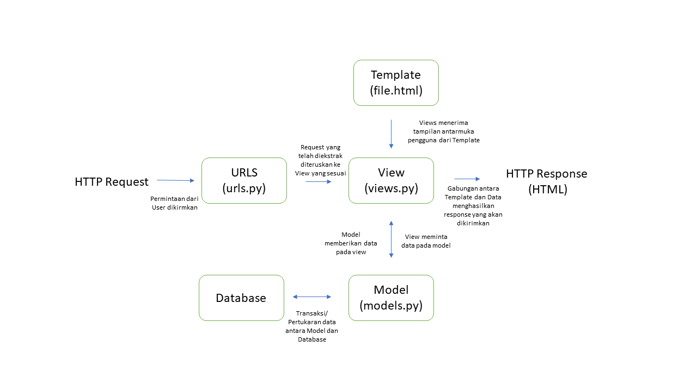

Nama : M.Alif Al Hakim

Kelas : PBP C

# Tugas 2

ink Adaptable : https://book-nest.adaptable.app/main/

### Jelaskan bagaimana cara kamu mengimplementasikan checklist di atas secara step-by-step (bukan hanya sekadar mengikuti tutorial).

##### Membuat sebuah proyek django baru

- Membuat direktori lokal dengan nama 'book_nest' lalu diinisiasi dengan git melalui perintah `git init`
- Membuat virtual environmet pada direktori yang telah dibuat dengan perintah `python -m venv env`
- Mengaktifkan virtual environmet dengan perintah `env\Scripts\activate.bat`
- Pada direktori yang sama tambahkan file `requirements.txt` dengan isi sebagai berikut.

  ```
  django
  gunicorn
  whitenoise
  psycopg2-binary
  requests
  urllib3
  ```

- Menginstall dependencies pada `requirements.txt` dengan perintah `pip install -r requirements.txt`
- Membuat Projek dengan nama `book_nest` dengan perintah `django-admin startproject book_nest .`
- Menambahkan "\*" pada ALLOWED_HOSTS di `settings.py`untuk keperluan deployment
- Tambahkan berkas `.gitignore` dan lakukan `git add` dan `git commit`pada repositori lokal
- Membuat repositori baru pada github dengan nama `book_nest` dengan visibility public
- Membuat branch utama baru pada repositori lokal dengan perintah `git branch -M main`
- Menghubungkan repositori lokal dengan github menggunakan perintah `git add origin <URL_REPO>`
- Melakukan penyimpanan pertama pada GitHub dengan `git push -u origin main`

##### Membuat aplikasi dengan nama main pada proyek tersebut.

- Buka direktori utama dari `book_nest` lalu aktifkan virtual environment
- Membuat aplikasi baru dengan perintah `python manage.py startapp main`
- Mendaftarkan aplikasi `main` ke dalam proyek. Dapat dilakukan dengan menambahkan `main` pada list `INSTALLED_APPS` di `settings.py` direktori proyek `book_nest`

##### Melakukan routing pada proyek agar dapat menjalankan aplikasi main.

- Buka berkas `urls.py` di dalam direktori proyek `book_nest` dan import fungsi `include` dari `django.urls`
- Tambahkan rute URL seperti berikut untuk mengarahkan ke tampilan `main` di dalam variabel `url_patterns`

  ```
  urlpatterns = [
      ...
      path('main/', include('main.urls')),
      ...
  ]
  ```

##### Membuat model pada aplikasi main dengan nama Item dan memiliki atribut wajib name, amount, dan description

- Buka berkas `models.py` pada direktori aplikasi main
- Isi berkas dengan kode berikut

  ```
  from django.db import models

  # Create your models here.
  class Item(models.Model):
      # Menambahkan atribut pada Item
      name = models.CharField(max_length=255) # Nama buku
      amount = models.IntegerField() # Harga
      description = models.TextField() # Deskripsi Buku
      author = models.CharField(max_length=255) # Penulis
  ```

- Menjalankan perintah `python manage.py makemigrations` untuk membuat migrasi model
- Menerapkan migrasi ke dalam basis data lokal dengan perintah `python manage.py migrate`

##### Membuat sebuah fungsi pada views.py untuk dikembalikan ke dalam sebuah template HTML yang menampilkan nama aplikasi serta nama dan kelas kamu.

- Buka berkas `views.py` pada aplikasi main lalu impor baris berikut `from django.shortcuts import render`
- Tambahkan fungsi show_main setelah mengimpor function render seperti berikut.

  ```
  def show_main(request):
      # Fungsi akan menerima permintaan HTTP dan mengembalikan tampilan yang sesuai

      # dictionary yang berisi data yang akan dikirimkan ke tampilan
      context = {
          'name': 'M.Alif Al Hakim',
          'class': 'PBP C'
      }

      # me-render tampilan main.html berdasarkan data yang dikirimkan
      return render(request, "main.html", context)
  ```

- Buat direktori baru bernama `templates` di dalam direktori aplikasi `main`
- Di dalam direktori `templates`, buat berkas baru bernama `main.html` dengan isi sebagai berikut.

  ```
  <h1>Book Nest</h1>

  <h5>Name:</h5>
  <p>{{ name }}</p> # Akan diisi oleh data yang diterima
  <h5>Class:</h5>
  <p>{{ class }} C</p>

  ```

##### Membuat sebuah routing pada urls.py aplikasi main untuk memetakan fungsi yang telah dibuat pada views.py.

- Buat berkas `urls.py` di dalam direktori `main`.
- Isi `urls.py` dengan kode berikut untuk mengatur rute URL yang terkait dengan aplikasi `main`

  ```
  from django.urls import path
  # Fungsi show_main dari modul main.views berperan sebagai tampilan yang akan ditampilkan ketika URL terkait diakses.
  from main.views import show_main

  app_name = 'main'

  urlpatterns = [
      path('', show_main, name='show_main'),
  ]
  ```

##### Melakukan deployment ke Adaptable terhadap aplikasi yang sudah dibuat sehingga nantinya dapat diakses oleh teman-temanmu melalui Internet

- Login pada Adaptable.io
- Tekan tombol `New App` dan pilih `Connect an Existing Repository`
- Pilih repositori proyek `book_nest` sebagai basis aplikasi yang akan di-deploy. Pilih branch yang ingin dijadikan sebagai deployment branch.
- Pilih Python App Template sebagai template deployment.
- Pilih PostgreSQL sebagai tipe basis data yang akan digunakan.
- Mengisi versi Python dengan 3.10 sesuai yang telah digunakan.
- Pada bagian Start Command masukkan perintah python manage.py migrate && gunicorn book_nest.wsgi.
- Masukkan nama aplikasi yang juga akan menjadi nama domain situs web aplikasi
- Centang bagian HTTP Listener on PORT dan klik Deploy App untuk memulai proses deployment aplikasi.

### Buatlah bagan yang berisi request client ke web aplikasi berbasis Django beserta responnya dan jelaskan pada bagan tersebut kaitan antara urls.py, views.py, models.py, dan berkas html.



### Jelaskan mengapa kita menggunakan virtual environment? Apakah kita tetap dapat membuat aplikasi web berbasis Django tanpa menggunakan virtual environment?

Virtual environmet adalah alat yang berguna untuk menyimpan _dependencies_ yang dibutuhkan oleh beberapa proyek berbeda dengan mengisolasi _dependencies_ yang dibutuhkan oleh setiap proyek. Contohnya ketika kita membuat dua proyek website yang menggunakan versi Django yang berbeda, maka kita dapat membuat virtual environment untuk masing-masing proyek dan menginstallnya dengan _dependencies_-nya masing-masing. Hal ini dapat mencegah terjadinya konflik pada proyek jika _dependencies_ di-_install_ di satu tempat yang sama. Selain itu, _virtual environment_ juga dapat menghindari polusi dari sistem. Polusi dapat berupa _pre-install package_ atau _package_ yang kita install sendiri. _Package_ tersebut bisa saja mempengaruhi _package_ yang kita butuhkan dalam proyek. Dengan _virtual environment_ kita bisa memastikan bahwa _package/dependencies_ yang ter-_install_ hanya yang berkaitan dengan proyek.

Jika kita tidak menggunakan _virtual environment_, maka antara proyek-proyek yang telah dibuat dapat mengalami konflik dikarenakan perbedaan _dependencies_. Hal ini dikarenakan kita hanya dapat menggunakan salah satu versi dari _library/dependencies_ terkait. Selain itu, tidak menggunakan _virtual environment_ memiliki potensi untuk terkena polusi dari sistem.

### Jelaskan apakah itu MVC, MVT, MVVM dan perbedaan dari ketiganya.

Model-View-Controller (MVC) framework adalah sebuah arsitektur/pola design yang membagi sebuah aplikasi menjadi tiga komponen utama, yaitu Model, View, Controller. Setiap komponen dibuat untuk mengerjakan tugas spesifik pada aplikasi. Controller adalah komponen yang menghubungkan view dan model. Komponen ini tidak perlu mengatasi/mengurus tentang _data logic_, komponen ini hanya perlu untuk memberi tahu model apa yang harus dilakukan dan berinteraksi dengan View untuk mendapatkan output yang dibutuhkan. View adalah komponen yang digunakan untuk mengerjakan tampilan muka dari aplikasi. Komponen ini menghasilkan tampilan muka untuk user berdasarkan permintaan yang didapat. View menghasilkan tampilan muka menggunakan data yang didapat dari model, akan tetapi view mendapatkannya melalui interaksi dengan controller. Model bertugas untuk mengurus semua yang berkaitan dengan _data logic_. Model bisa menambah atau mengambil data dari database dan memberikan respon pada controller terkait _request_ yang diterima.

Model-View-Template (MVT) framework adalah sebuah arsitektur/pola design yang membagi sebuah aplikasi menjadi
tiga komponen utama, yaitu Model, View, dan Template. View adalah komponen yang menerima _request_, memprosesnya, dan mengirimkan _response_. View mendapatkan data yang dibutuhkan melalui Models dan me-_render_-nya pada tampilan muka menggunakan Templates. Model adalah komponen yang mengatur struktur data pada aplikasi Django. Model bertanggung jawab dalam menjaga dan mengatur data yang dibutuhkan aplikasi sehingga mempunyai kemampuan dalam menambah, meng-_update_, membaca, dan menghapus data dari _database_. Template adalah sebuah _text file_ yang mendefinisikan struktur atau layout dari tampilan antar muka aplikasi. Template dapat menerima data dari view dan me-_render_-nya ke tampilan antar muka.

Model - View - ViewModel (MVVM) framework adalah sebuah arsitektur/pola design yang memisahkan antara _data presentation logic_ dan _business logic_ dari aplikasi. MVVM terdiri dari tiga komponen, yaitu Model, View, dan ViewModel. Model bertanggung jawab atas abstraksi sumber data. Model dan ViewModel akan bekerja sama dalam mendapatkan dan menyimpan data.
View adalah komponen yang bertujuan untuk memberikan informasi pada ViewModel terkait permintaan dari _user_. Komponen ini terhubung ke ViewModel dan tidak memiliki _application logic_ sama sekali. Sementara ViewModel betugas sebagai penghubung antara Model dan View.

Perbedaan dari ketiga arsitektur tersebut terletak bagaimana mereka mengorganisasi logika aplikasi, dan menampilkan tampilan antar muka. Pada MVT, View adalah komponen yang akan menerima _request_ lalu memprosesnya menjadi _respons_ dengan mengakses data dari Model dan menggunakan struktur pada Template. Sementara, pada MVC, Controller adalah komponen yang menerima input dari _user_ dan memberikan _respons_ setelah mendapatkan data yang diperlukan dari Model dan tampilan antar muka dari View. Dan terakhir, pada MVTT, View adalah komponen yang menerima permintaan dan memberikan respon pada _user_. Dimana ViewModel yang menghubungkan View dan Model dalam pertukaran data.

# Tugas 3

### Apa perbedaan antara form POST dan form GET dalam Django?

form POST sendiri akan mengumpulkan data yang dimasukkan pada form, melakukan _encoding_ pada data tersebut untuk ditransmisikan dan mengirimkannya ke server. Dan setelahnya akan menerima kembali responnya.
Sementara, form GET akan mengumpulkan data yang akan dikirim menjadi sebuah string dan menggunakannya untuk membuat sebuah URL. URL tersebut mengandung alamat dimana data harus dikirim sekaligus data _keys_ dan _values_-nya.
_Request_ yang digunakan untuk mengubah kondisi dari sistem seperti mengubah database sebaiknya menggunakan POST. GET sebaiknya hanya digunakan pada _request_ yang tidak mempengaruhi kondisi sistem.
Contoh penggunaan GET seperti pada _web search form_ dan POST seperti _password form_.

### Apa perbedaan utama antara XML, JSON, dan HTML dalam konteks pengiriman data?

XML dan JSON digunakan untuk menyimpan dan men-transmisikan data, sementara HTML digunakan untuk mendeskripsikan bagaimana suatu data ditampilkan. Sementara itu XML dan JSON memiliki beberapa perbedaan yaitu:

1. XML menghasilkan suatu XML document, sementara JSON menghasilkan suatu JSON String.
2. XML menggunakan XML DOM untuk menulusuri dokumen, sementara JSON menggunakan `JSON.parse()` untuk melakukan parsing JSON string.
3. JSON cenderung lebih mudah digunakan dibanding XML dan untuk aplikasi berbasis AJAX, JSON lebih cepat dibandingkan XML

### Mengapa JSON sering digunakan dalam pertukaran data antara aplikasi web modern?

Pertama, JSON memiliki karakteristik yang simple dan mudah dibaca. JSON cenderung mudah untuk ditulis dan dipahami dikarenakan JSON menggunakan format yang _human-readable_ format yang terdiri dari pasangan _key-value_. Kedua, JSON kompatibel dan dapat digunakan pada berbagai _platform_, bahasa pemrograman, dan _frameworks_. Ketiga,JSON memiliki performa dan efisiensi yang lebih baik dibanding format pengiriman data yang lain seperti XML. Hal ini dikarenakan JSON punya struktur yang simpel dan tidak memiliki informasi yang berulang atau tidak diperlukan seperti closing tags, namespaces, dan lain-lain.

### Jelaskan bagaimana cara kamu mengimplementasikan checklist di atas secara step-by-step (bukan hanya sekadar mengikuti tutorial).

- #### Membuat input form untuk menambahkan objek model pada app sebelumnya.

1. Untuk mempermudah proses selanjutnya, diatur routing dari `main` ke `/` agar aplikasi main dapat diakses langsung saat membuka website. Buka `urls.py` yang ada pada folder proyek `book_nest` dan ubah path `main/` menjadi `''` pada `urlpatterns`.
2. Implementasi Skeleton sebagai kerangka views. Buat folder `templates` pada _root folder_ dan buat sebuah berkas HTML baru bernama `base.html` yang berfungsi sebagai template dasar halaman web lainnya. Lalu isi `base.html` dengan kode berikut:

```

<!DOCTYPE html>
<html lang="en">
    <head>
        <meta charset="UTF-8" />
        <meta
            name="viewport"
            content="width=device-width, initial-scale=1.0"
        />
        
        
    </head>

    <body>
        
        
    </body>
</html>
```

3. Pada subdirektori `book_nest`, buka `settings.py` dan sesuaikan kode berikut pada bagian `TEMPLATES`.

```
TEMPLATES = [
    {
        'BACKEND': 'django.template.backends.django.DjangoTemplates',
        'DIRS': [BASE_DIR / 'templates'], # Tambahkan kode ini
        'APP_DIRS': True,
        ...
    }
]
```

4. Ubah berkas `main.html` pada direktori `main` sehingga menggunakan template dari `base.html` seperti berikut.

```



  <h1>Book Nest</h1>

  <h5>Name:</h5>
  <p>{{name}}</p>

  <h5>Class:</h5>
  <p>{{class}}</p>

```

5. Buat berkas `forms.py` pada direktori `main` untuk membuat struktur form yang dapat menerima data item baru. Isi `forms.py` dengan kode berikut.

```
from django.forms import ModelForm
from main.models import Item

class ItemForm(ModelForm):
    class Meta:
        model = Item # Menunjukkan Model yang digunakan untuk form
        fields = ["name", "price", "amount","author","description"] # Field dari model Item
```

6. Modifikasi `views.py` pada folder `main` dengan menambahkan fungsi `create_item` yang dapat menambahkan data item setelah di-_submit_ dari form.

```
from django.http import HttpResponseRedirect
from main.forms import ItemForm
from django.urls import reverse

def create_item(request):
    form = ItemForm(request.POST or None)

    if form.is_valid() and request.method == "POST":
        form.save()
        return HttpResponseRedirect(reverse('main:show_main'))

    context = {'form': form}
    return render(request, "create_item.html", context)
```

7. Import fungsi tersebut dan tambahkan _path url_ ke dalam `urlpatterns` pada `urls.py` di `main`.

```
path('create-item', create_item, name='create_item'),
```

8.  Buat berkas `create_item.html` pada direktori `main/templates` dan isi dengan kode berikut untuk membuat halaman form

```
 
<h1>Add New Item</h1>

<form method="POST">
  
  <table>
    {{ form.as_table }}
    <tr>
      <td></td>
      <td>
        <input type="submit" value="Add Item" />
      </td>
    </tr>
  </table>
</form>



```

9. Tambahkan kode berikut pada `main.html` di dalam `` untuk menampilkan data produk dalam bentuk _table_ serta tombol "Add New Item" yang akan _redirect_ ke halaman form.

```
<p>
  Saat ini, kami memiliki total {{items.count}} judul buku yang dapat Anda
  temukan di Book Nest
</p>

<table>
  <tr>
    <th>Name</th>
    <th>Price</th>
    <th>Amount</th>
    <th>Author</th>
    <th>Description</th>
  </tr>

   Berikut cara memperlihatkan data produk di bawah baris ini
   
  <tr>
    <td>{{item.name}}</td>
    <td>{{item.price}}</td>
    <td>{{item.amount}}</td>
    <td>{{item.author}}</td>
    <td>{{item.description}}</td>
  </tr>
  
</table>

<br />

<a href="">
  <button>Add New Item</button>
</a>


```

- #### Tambahkan 5 fungsi views untuk melihat objek yang sudah ditambahkan dalam format HTML, XML, JSON, XML by ID, dan JSON by ID.

1. Modifikasi fungsi `show_main` pada `views.py` di folder `main` agar dapat mengembalikan render HTML yang berisi data-data form yang sudah di-_submit_.

```
def show_main(request):
    items = Item.objects.all() # Ambil Seluruh Item pada database

    context = {
        'name': 'M.Alif Al Hakim',
        'class': 'PBP C',
        'items': items
    }

    return render(request, "main.html", context)
```

2. Membuat fungsi `show_xml` untuk mengembalikan data-data dalam bentuk XML.

```
def show_xml(request):
    data = Item.objects.all()
    return HttpResponse(serializers.serialize("xml", data), content_type="application/xml")
```

3. Membuat fungsi `show_json` untuk mengembalikan data-data dalam bentuk JSON.

```
def show_json(request):
    data = Item.objects.all()
    return HttpResponse(serializers.serialize("json", data), content_type="application/json")
```

4. Membuat fungsi `show_xml_by_id` untuk mengembalikan data dari suatu ID dalam bentuk XML.

```
def show_xml_by_id(request, id):
    data = Item.objects.filter(pk=id)
    return HttpResponse(serializers.serialize("xml", data), content_type="application/xml")
```

5. Membuat fungsi `show_json_by_id` untuk mengembalikan data dari suatu ID dalam bentuk JSON.

```
def show_json_by_id(request, id):
    data = Item.objects.filter(pk=id)
    return HttpResponse(serializers.serialize("json", data), content_type="application/json")
```

- #### Membuat routing URL untuk masing-masing views yang telah ditambahkan pada poin 2.

Import 5 fungsi yang telah dibuat sebelumnya dan untuk setiap fungsi tambahkan _path url_ ke dalam `urlpatterns`. Isi dari `urls.py` pada folder `main` akan seperti berikut.

```
from django.urls import path
from main.views import show_main,create_item,show_xml,show_json, show_xml_by_id, show_json_by_id

app_name = 'main'

urlpatterns = [
    path('', show_main, name='show_main'),
    path('create-item', create_item, name='create_item'),
    path('xml/', show_xml, name='show_xml'),
    path('json/', show_json, name='show_json'),
    path('xml/<int:id>/', show_xml_by_id, name='show_xml_by_id'),
    path('json/<int:id>/', show_json_by_id, name='show_json_by_id'),
]
```

### Mengakses kelima URL di poin 2 menggunakan Postman, membuat screenshot dari hasil akses URL pada Postman, dan menambahkannya ke dalam README.md.


